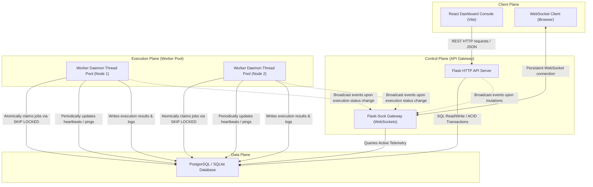

# JobSphere: System Architecture

This document describes the runtime components of JobSphere and their communication paths.

```mermaid
graph TB
    subgraph "Client Plane"
        ReactConsole["React Dashboard Console (Vite)"]
        BrowserSock["WebSocket Client (Browser)"]
    end

    subgraph "Control Plane (API Gateway)"
        FlaskAPI["Flask HTTP API Server"]
        WSServer["Flask-Sock Gateway (WebSockets)"]
    end

    subgraph "Data Plane"
        PostgresDB["PostgreSQL / SQLite Database"]
    end

    subgraph "Execution Plane (Worker Pool)"
        WorkerNode1["Worker Daemon Thread Pool (Node 1)"]
        WorkerNode2["Worker Daemon Thread Pool (Node 2)"]
    end

    %% Client Communication
    ReactConsole -->|REST HTTP requests / JSON| FlaskAPI
    BrowserSock <-->|Persistent WebSocket connection| WSServer

    %% Control Plane DB Actions
    FlaskAPI -->|SQL Read/Write / ACID Transactions| PostgresDB
    WSServer -->|Queries Active Telemetry| PostgresDB

    %% Worker Daemon Operations
    WorkerNode1 -->|Atomically claims jobs via SKIP LOCKED| PostgresDB
    WorkerNode2 -->|Atomically claims jobs via SKIP LOCKED| PostgresDB
    WorkerNode1 -->|Periodically updates heartbeats / pings| PostgresDB
    WorkerNode2 -->|Periodically updates heartbeats / pings| PostgresDB
    WorkerNode1 -->|Writes execution results & logs| PostgresDB
    WorkerNode2 -->|Writes execution results & logs| PostgresDB

    %% Real-time Socket Event Broadcasting
    FlaskAPI -.->|Broadcast events upon mutations| WSServer
    WorkerNode1 -.->|Broadcast events upon execution status change| WSServer
    WorkerNode2 -.->|Broadcast events upon execution status change| WSServer
```
