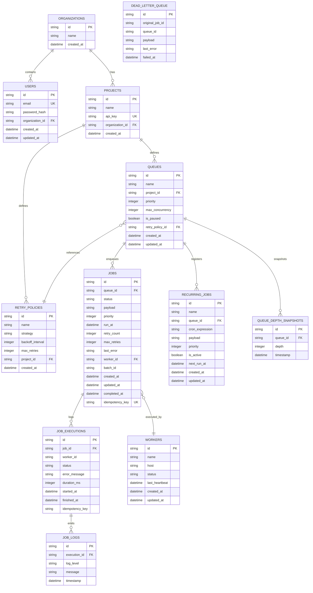

# JobSphere: Entity-Relationship (ER) Schema

This document maps the actual database schema of JobSphere including table keys, attributes, and relationships.

```mermaid
erDiagram
    ORGANIZATIONS ||--o{ USERS : "contains"
    ORGANIZATIONS ||--o{ PROJECTS : "has"
    PROJECTS ||--o{ QUEUES : "defines"
    PROJECTS ||--o{ RETRY_POLICIES : "defines"
    QUEUES ||--o{ JOBS : "enqueues"
    QUEUES ||--o{ RECURRING_JOBS : "registers"
    QUEUES ||--o{ QUEUE_DEPTH_SNAPSHOTS : "snapshots"
    QUEUES }o--|| RETRY_POLICIES : "references"
    JOBS ||--o{ JOB_EXECUTIONS : "logs"
    JOBS }o--|| WORKERS : "executed_by"
    JOB_EXECUTIONS ||--o{ JOB_LOGS : "emits"
    
    ORGANIZATIONS {
        string id PK
        string name
        datetime created_at
    }

    USERS {
        string id PK
        string email UK
        string password_hash
        string organization_id FK
        datetime created_at
        datetime updated_at
    }

    PROJECTS {
        string id PK
        string name
        string api_key UK
        string organization_id FK
        datetime created_at
    }

    RETRY_POLICIES {
        string id PK
        string name
        string strategy
        integer backoff_interval
        integer max_retries
        string project_id FK
        datetime created_at
    }

    QUEUES {
        string id PK
        string name
        string project_id FK
        integer priority
        integer max_concurrency
        boolean is_paused
        string retry_policy_id FK
        datetime created_at
        datetime updated_at
    }

    JOBS {
        string id PK
        string queue_id FK
        string status
        string payload
        integer priority
        datetime run_at
        integer retry_count
        integer max_retries
        string last_error
        string worker_id FK
        string batch_id
        datetime created_at
        datetime updated_at
        datetime completed_at
        string idempotency_key UK
    }

    RECURRING_JOBS {
        string id PK
        string name
        string queue_id FK
        string cron_expression
        string payload
        integer priority
        boolean is_active
        datetime next_run_at
        datetime created_at
        datetime updated_at
    }

    WORKERS {
        string id PK
        string name
        string host
        string status
        datetime last_heartbeat
        datetime created_at
        datetime updated_at
    }

    JOB_EXECUTIONS {
        string id PK
        string job_id FK
        string worker_id
        string status
        string error_message
        integer duration_ms
        datetime started_at
        datetime finished_at
        string idempotency_key
    }

    JOB_LOGS {
        string id PK
        string execution_id FK
        string log_level
        string message
        datetime timestamp
    }

    DEAD_LETTER_QUEUE {
        string id PK
        string original_job_id
        string queue_id
        string payload
        string last_error
        datetime failed_at
    }

    QUEUE_DEPTH_SNAPSHOTS {
        string id PK
        string queue_id FK
        integer depth
        datetime timestamp
    }
```
